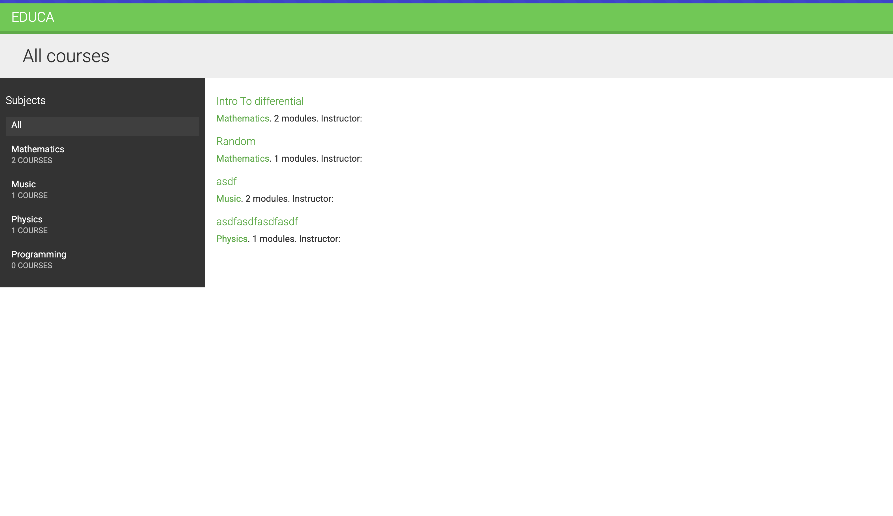
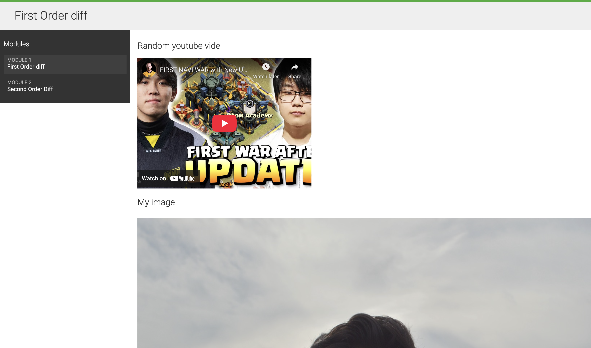
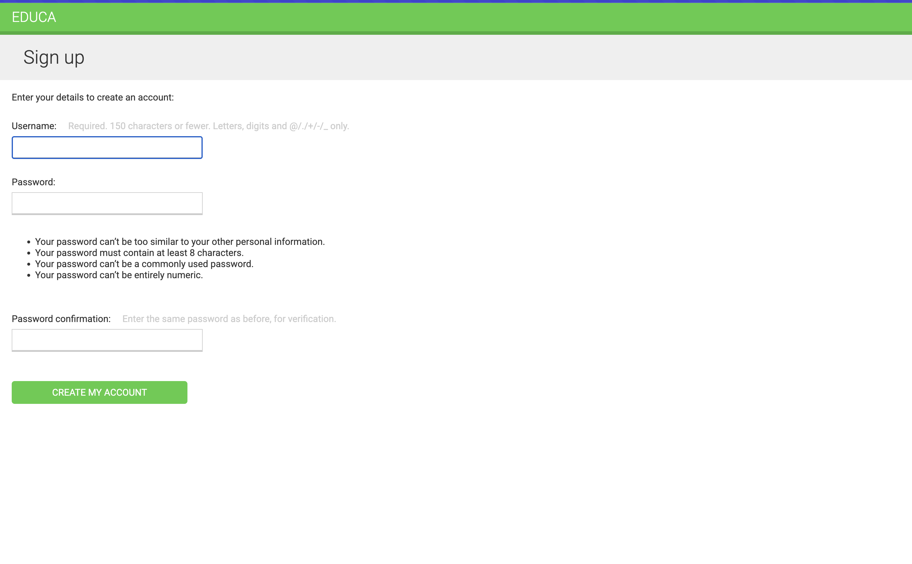
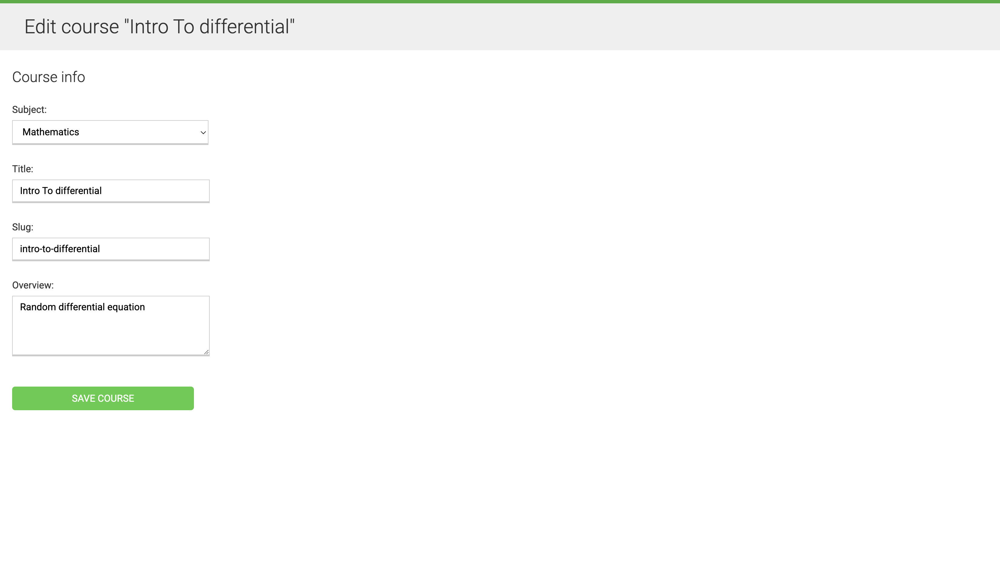

# CMS for Managing Subjects, Courses, Modules, and Content

A comprehensive content management system (CMS) designed for managing subjects, courses, modules, and various types of content.

## Features

- **Subjects, Courses, and Modules**:
  - Organize courses under subjects, with each course containing multiple modules.
- **Content Management**:
  - Support for text, images, videos, and file-based content.
- **User Authentication & Enrollment**:
  - Student authentication and registration.
  - Students can enroll in courses.
- **Permissions & Access Control**:
  - Uses Django Groups to manage permissions.
- **Reordering Modules & Content**:
  - Drag-and-drop functionality to reorder modules and content.
- **Caching for Performance**:
  - Cache queries, templates, and site content using Redis.

## Tech Stack

- **Backend**: Django,
- **Frontend**: Django Templates, HTML, CSS, JavaScript
- **Database**: Sqlite3
- **Caching**: Redis or Memcached

## Screenshots

<p align="center">
  
  
</p>

<p align="center">
  
  
</p>

## Installation

1. Clone the repository:

   ```sh
   git clone https://github.com/bikraj2/cms.git
   cd cms
   ```

2. Install dependencies:

   ```sh
   pip install -r requirements.txt
   ```

3. Set up environment variables and database.

4. Run the application:
   ```sh
   python manage.py runserver
   ```

## Configuration

- Update `settings.py` for internationalization.
- Configure Django Groups for user permissions.
- Set up Redis for caching queries, templates, and the site.
